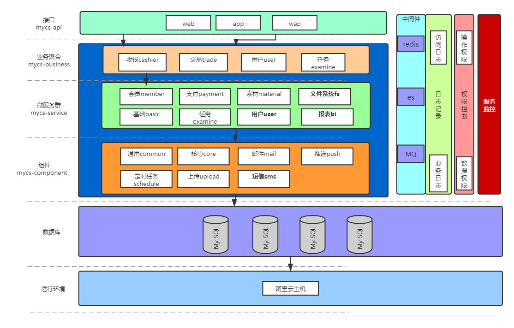

## 1. 项目说明
本项目主要依赖于SpringBoot2.2.2.RELEASE,MybatisPlus 3.2.0和lombok1.18.8。SpringBoot 作为项目的MVC层和Service层框架, MybatisPlus作为DAO层框架，lombok 用于简化java代码，让java代码变得简洁，需要Lombok插件支持。
## 2. 项目总体技术
* 前后端分离的企业级微服务架构
* 基于`Spring Boot 2.0.X`、`Spring Cloud Hoxton.RELEASE`和`Spring Cloud Alibaba`
* 深度定制`Spring Security`真正实现了基于`RBAC`、`jwt`和`oauth2`的无状态统一权限认证的解决方案
* 引入组件化的思想实现高内聚低耦合，项目代码简洁注释丰富上手容易
* 注重代码规范，严格控制包依赖，每个工程基本都是最小依赖
## 3. 功能介绍
* **统一认证功能**
  * 支持oauth2的四种模式登录
  * 支持用户名、密码加图形验证码登录
  * 支持手机号加密码登录
  * 支持openId登录
  * 支持第三方系统单点登录
* **分布式系统基础支撑**
  * 服务注册发现、路由与负载均衡
  * 服务降级与熔断
  * 服务限流(url/方法级别)
  * 统一配置中心
  * 统一日志中心
  * 分布式锁
  * 分布式任务调度器
  * 分布式事务
* **系统监控功能**
  * 服务调用链监控
  * 应用拓扑图
  * 应用监控(应用健康、JVM、内存、线程)
  * 错误日志查询
  * 慢查询SQL监控
  * 应用吞吐量监控(qps、rt)
  * 服务降级、熔断监控
  * 服务限流监控
* **业务基础功能支撑**
  * 高性能方法级幂等性支持
  * RBAC权限管理，实现细粒度控制(方法、url级别)
  * 快速实现导入、导出功能
  * 代码生成器
  * 统一跨域处理
  * 统一异常处理

## 4.项目目录结构
* 总体目录

~~~
 mycs        																		主目录
    ├─mycs-business-examine															聚合考核业务
    ├─mycs-component																组件
    │  ├─mycs-component-cache														缓存组件
    │  ├─mycs-component-common														通用功能组件
    │  ├─mycs-component-core														核心类组件
    │  ├─mycs-component-mail														邮件组件
    │  ├─mycs-component-mq															消息队列组件
    │  ├─mycs-component-schedule													定时计划组件
    │  └─mycs-component-upload														上传组件
    ├─mycs-front-api-app															提供app接口
    ├─mycs-front-api-cms															提供cms接口
    ├─mycs-front-api-upload															提供上传接口
    ├─mycs-front-api-web															提供web接口
    ├─mycs-parent																	父pom，定义所有的版本
    ├─mycs-service-basic															基础信息微服务
    ├─mycs-service-bi																数据报表微服务
    ├─mycs-service-examine															考核微服务
    ├─mycs-service-file-system														文件系统微服务
    ├─mycs-service-material															素材微服务
    ├─mycs-service-member															会员微服务
    └─mycs-service-user															    用户微服务
~~~

* 微服务目录

~~~
mycs-service-XXX
    ├─mycs-service-xxx-feign													微服务应用其他服务
    ├─mycs-service-xxx-provider													本服务提供给外服务接口包括dto
    └─mycs-service-xxx-server													本服务提供的接口实现服务
~~~

## 4. 内部开发规范
    整个项目强制遵循《阿里巴巴Java开发手册》
## 5. 项目总体架构
